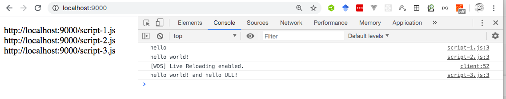

## Deployments

* [https://ull-esit-pl.github.io/async-js-series-webpack/](https://ull-esit-pl.github.io/async-js-series-webpack/)
* [https://ull-esit-pl.github.io/async-js-series-webpack/load-script.html](https://ull-esit-pl.github.io/async-js-series-webpack/load-script.html)


## The loadScript function

Take a look at the function `loadScript(src)`, that loads a script with the given `src`:

```js
    function loadScript(src) {
      // creates a <script> tag and append it to the page
      // this causes the script with given src to start loading and run when complete
      let script = document.createElement('script');
      script.src = src;
      document.head.append(script);
    }
```

(See [https://javascript.info/callbacks](https://javascript.info/callbacks) for more details)

It appends to the document the new, dynamically created, tag `<script src="…">` with given `src`. The browser automatically starts loading it and executes when complete.

We can use this function like this:

```js
    // load and execute the script at the given path
    loadScript('/my/script.js');
```

The script is executed *asynchronously*, as it starts loading now, but runs later, when the function has already finished.

If there’s any code below `loadScript(…)`, it doesn’t wait until the script loading finishes.

```js
    loadScript('/my/script.js');
    // the code below loadScript
    // doesn't wait for the script loading to finish
    // ...
```

Let’s add a callback function as a second argument to loadScript that should execute when the script loads. What if the script loading fails? Our callback should be able to react on that. Here’s an improved version of `loadScript`:

```js
      function loadScript(src, callback) {
        let script = document.createElement('script');
        script.src = src;
      
        script.onload = () => callback(null, script);
        script.onerror = () => callback(new Error(`Script load error for ${src}`));
      
        document.head.append(script);
      }
```

## Loading Several Scripts Sequentially

And so, if we want to load several scripts, each one using the functions defined in the former ones we have to express our dependencies introducing a callback argument and nesting the succesive callbacks inside the callbacks:

```js
<!DOCTYPE html>
<html lang="en">
  <head>
    <meta charset="UTF-8">
    <meta name="viewport" content="width=device-width, initial-scale=1.0">
    <title>Document</title>
  </head>
  <body>
    <p id="out"></p>
    <script>
      'use strict';
      let out = document.querySelector('p');

      function loadScript(src, callback) {
        let script = document.createElement('script');
        script.src = src;
      
        script.onload = () => callback(null, script);
        script.onerror = () => callback(new Error(`Script load error for ${src}`));
      
        document.head.append(script);
      }
           
      loadScript('/script-1.js', (error, script) => {
        if (error) {
          console.error( error ); 
        } else {
          const message = `Cool!, the script '${script.src}' is loaded: "${hello()}"`;
          out.innerHTML = message;
          console.log(message);

          loadScript('/script-2.js', (error, script) => {
            if (error) {
              console.error( error ); 
            } else {
              const message = `Great!, the script '${script.src}' is loaded: "${world()}"`;
              out.innerHTML += `<br/>${message}`;
              console.log(message);
              loadScript('script-3.js', (error, script) => {
                if (error) {
                  console.error( error );
                } else {
                  const message = `Unbelievable!, the script '${script.src}' is loaded: "${ull()}"`;
                  out.innerHTML += `<br/>${message}`;
                  console.log(message);
                  // ...continue after all scripts are loaded 
                }
              });
            }
          })
        }
      });
      </script>      
  </body>  
</html>
```

That’s sometimes called *callback hell* or *pyramid of doom.* (imagen del libro https://javascript.info)

<div class="image__ratio" style="padding-top:59.743040685224834%">
</div>
<object type="image/svg+xml" data="https://javascript.info//article/callbacks/callback-hell.svg" width="467" height="279" class="image__image">

  

</object>

## Async-es: The series method

A pure ESM version of Async is available as <a href="https://www.npmjs.com/package/async-es" rel="nofollow"><code>async-es</code></a>.

We can use the `series` method of [async-es](https://www.npmjs.com/package/async-es)
to avoid the *callback hell* / *pyramid of doom*:

```
[~/.../load-script-seq(master)]$ pwd -P
/Users/casiano/local/src/javascript/learning/async/load-script-seq
[~/.../load-script-seq(master)]$ ls -l src/index.js
-rw-r--r--  1 casiano  staff  574 25 feb 11:43 src/index.js
```

```js
import { series } from "async-es";

function loadScript(src, callback) {
    let script = document.createElement('script');
    script.src = src;

    script.onload = () => callback(null, script);
    script.onerror = () => callback(new Error(`Script load error for ${src}`));

    document.head.append(script);
}

let p = document.querySelector('p');

series(
  [
     cb => loadScript('/script-1.js', cb),
     cb => loadScript('/script-2.js', cb),
     cb => loadScript('/script-3.js', cb)
   ],
   (err, results) => p.innerHTML = results.map(s => s.src).join("<br/>")
);
```

## Webpack

Webpack is a **static module bundler** for JavaScript applications — it takes all the code from your application and makes it usable in a web browser. Modules are reusable chunks of code built from your app's JavaScript, node_modules, images, and the CSS styles which are packaged to be easily used in your website


When Webpack processes your application, it builds a dependency graph which maps out the modules that your project needs and generates one or more bundles. A **bundle** is a distinct grouping of connected code that has been compiled and transformed for the browser.

The solution used in this repo relies on [webpack](https://webpack.js.org/guides/getting-started/). 

Read the [Getting Started](https://webpack.js.org/guides/getting-started/) tutorial.

I have added [webpack-dev-server](https://webpack.js.org/configuration/dev-server/) 
and a script `start:dev` to make it easier the development:

```
[~/.../load-script-seq(master)]$ npm run start:dev

> sol@1.0.0 start:dev /Users/casiano/local/src/javascript/learning/async/load-script-seq
> webpack-dev-server

ℹ ｢wds｣: Project is running at http://localhost:9000/
ℹ ｢wds｣: webpack output is served from /
ℹ ｢wds｣: Content not from webpack is served from /Users/casiano/local/src/javascript/learning/async/load-script-seq/dist
ℹ ｢wdm｣: Hash: bfb427cb5bbcc46dcb2d
Version: webpack 4.41.6
Time: 1305ms
Built at: 2020-02-25 12:02:54
      Asset      Size  Chunks             Chunk Names
favicon.ico  15.1 KiB          [emitted]
    main.js   679 KiB    main  [emitted]  main
script-1.js  52 bytes          [emitted]
script-2.js  61 bytes          [emitted]
script-3.js  66 bytes          [emitted]
Entrypoint main = main.js
[0] multi (webpack)-dev-server/client?http://localhost:9000 ./src/index.js 40 bytes {main} [built]
[./node_modules/ansi-html/index.js] 4.16 KiB {main} [built]
[./node_modules/async-es/apply.js] 1.34 KiB {main} [built]
[./node_modules/async-es/applyEach.js] 1.6 KiB {main} [built]
[./node_modules/async-es/index.js] 9.83 KiB {main} [built]
[./node_modules/webpack-dev-server/client/index.js?http://localhost:9000] (webpack)-dev-server/client?http://localhost:9000 4.29 KiB {main} [built]
[./node_modules/webpack-dev-server/client/overlay.js] (webpack)-dev-server/client/overlay.js 3.51 KiB {main} [built]
[./node_modules/webpack-dev-server/client/socket.js] (webpack)-dev-server/client/socket.js 1.53 KiB {main} [built]
[./node_modules/webpack-dev-server/client/utils/createSocketUrl.js] (webpack)-dev-server/client/utils/createSocketUrl.js 2.91 KiB {main} [built]
[./node_modules/webpack-dev-server/client/utils/log.js] (webpack)-dev-server/client/utils/log.js 964 bytes {main} [built]
[./node_modules/webpack-dev-server/client/utils/reloadApp.js] (webpack)-dev-server/client/utils/reloadApp.js 1.59 KiB {main} [built]
[./node_modules/webpack-dev-server/client/utils/sendMessage.js] (webpack)-dev-server/client/utils/sendMessage.js 402 bytes {main} [built]
[./node_modules/webpack-dev-server/node_modules/strip-ansi/index.js] (webpack)-dev-server/node_modules/strip-ansi/index.js 161 bytes {main} [built]
[./node_modules/webpack/hot sync ^\.\/log$] (webpack)/hot sync nonrecursive ^\.\/log$ 170 bytes {main} [built]
[./src/index.js] 574 bytes {main} [built]
    + 123 hidden modules
ℹ ｢wdm｣: Compiled successfully.
```

When we visit [http://localhost:9000/](http://localhost:9000/) we see something like this:



### Webpack Configuration File

This is our webpack configuration file:

```
~/.../p3-t1-handling-events/sol]$ cat webpack.config.js
```

```js
const path = require('path');
const CopyPlugin = require('copy-webpack-plugin');

module.exports = {
  entry:  path.resolve('.', 'src', 'index.js'),
  mode: 'development',
  output: {
    filename: 'main.js',
    path: path.resolve(__dirname, 'dist'),
  },
  devServer: {
    contentBase: path.join(__dirname, 'dist'),
    compress: true,
    port: 9000
  },
  plugins: [
    new CopyPlugin([
      { from: 'script-*.js' },
      { from: "favicon.ico" }
    ]),
  ],
};
```

We have configured:

* the [copy-webpack-plugin](https://github.com/webpack-contrib/copy-webpack-plugin) to copy the required files onto the distribution directory `dist`
* the [webpack-dev-server](https://webpack.js.org/configuration/dev-server/)

## The build task

```
[~/.../p3-t1-handling-events/sol]$ tree dist/
dist/
└── index.html

0 directories, 2 files
[~/.../p3-t1-handling-events/sol]$ npm run build

> sol@1.0.0 build /private/tmp/sol
> webpack

Hash: c0d97c54460908d8cf42
Version: webpack 4.41.6
Time: 487ms
Built at: 2020-02-25 12:40:17
      Asset      Size  Chunks             Chunk Names
favicon.ico  15.1 KiB          [emitted]
    main.js   323 KiB    main  [emitted]  main
script-1.js  52 bytes          [emitted]
script-2.js  61 bytes          [emitted]
script-3.js  66 bytes          [emitted]
Entrypoint main = main.js
[./node_modules/webpack/buildin/global.js] (webpack)/buildin/global.js 472 bytes {main} [built]
[./src/index.js] 574 bytes {main} [built]
    + 105 hidden modules
[[~/.../p3-t1-handling-events/sol]$ tree -s dist
dist
├── [      15492]  favicon.ico
├── [        155]  index.html
├── [     331143]  main.js
├── [         52]  script-1.js
├── [         61]  script-2.js
└── [         66]  script-3.js

0 directories, 6 files
```