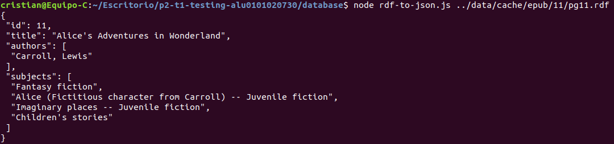
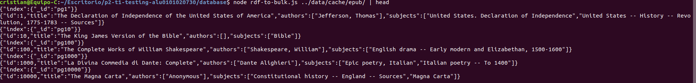
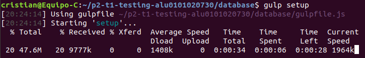

## Transforming Data and Testing Continuously

Para las pruebas TDD hemos usado las librerías Mocha y Chai para definir las siguientes pruebas en test/parse-rdf-test.js:
```js
'use strict';

const fs = require('fs');
const expect = require('chai').expect;
const rdf = fs.readFileSync(`${__dirname}/pg132.rdf`);
const parseRDF = require('../lib/parse-rdf.js');

describe('parseRDF', () => {
	it('should be a function', () => {
		expect(parseRDF).to.be.a('function');
	});
	it('should parse RDF content', () => {
		const book = parseRDF(rdf);
		expect(book).to.be.an('object');
		expect(book).to.have.a.property('id', 132);
		expect(book).to.have.a.property('title', 'The Art of War');
		expect(book).to.have.a.property('authors').that.is
			.an('array').with.lengthOf(2).and
			.contains('Sunzi, active 6th century B.C.').and
			.contains('Giles, Lionel');
		expect(book).to.have.a.property('subjects')
			.that.is.an('array').with.lengthOf(2)
			.and.contains('Military art and science -- Early works to 1800')
			.and.contains('War -- Early works to 1800');
		
		//Extracting Classification Codes
		expect(book).to.have.a.property('lcc').that.is
		.an('string').with.lengthOf(1).and
		.match(/[^IOWXY].*/);

		//Extracting Sources
		expect(book).to.have.a.property('sources').that.is.an('array');
		book.sources.forEach(e => expect(e).to.have.all
		.keys('source','format'));


	});


});
```
Las pruebas se basan en comprobar que nuestro objeto book contiene los identificadores que hemos especificado con sus respectivos valores. Para hacer esto hemos tenido que parsearlo mediante el archivo lib/parse-rdf.js:
```js
'use strict';
const cheerio = require('cheerio');

module.exports = rdf => {
	const $ = cheerio.load(rdf);

	const book = {};

	book.id = +$('pgterms\\:ebook').attr('rdf:about').replace('ebooks/','');
	book.title = $('dcterms\\:title').text();
	book.authors = $('pgterms\\:agent pgterms\\:name').toArray()
	.map(elem => $(elem).text());
	book.subjects = $('[rdf\\:resource$="/LCSH"]')
	.parent().find('rdf\\:value')
	.toArray().map(elem => $(elem).text());

	//Extracting Classification Codes
	book.lcc = $('[rdf\\:resource$="/LCC"]')
	.parent().find('rdf\\:value').text();

	//Extracting Sources
	book.sources = $('dcterms\\:hasFormat').toArray().map(e => {
		var object = {
		"source": $(e).find('pgterms\\:file').attr('rdf:about'),
		"format": $(e).find('rdf\\:value').text()
		}
		return object;
	});


	return book;
};
```
Para manipular el archivo que recibe como argumento la función del módulo que hemos usado es la librería cheerio, esta nos ofrece una API muy potente para traducir lenguajes basados en etiquetas (html,xml...), para atravesar sus componentes y manipularlos.  

Para ejecutar las pruebas escribimos  
> npm run test  

**Los ejercicios que se pedían están implementados en los códigos que se ven encima, cada uno debajo de su respectivo comentario**

También hemos implementado 2 programas en la carpeta databases, ambos utilizan el módulo que implementamos:
*   **rdf-to-json.js** interpreta el archivo rdf que recibe por la línea de argumentos de la consola e imprime por pantalla el árbol JSON

*   **rdf-to-bulk.js** similar al anterior, pero este recorre todo el directorio de la base de datos y genera un archivo con todo su contenido también en formato JSON.


### Gulp
Las últimas versiones de node no son compatibles con gulp 3.9.1 por lo que hay que hacer downgrade a node 9.0.0, que es la version que he usado yo e instalar gulp-cli.  
> nvm install 9.0.0  
> npm install --global gulp-cli  
  


